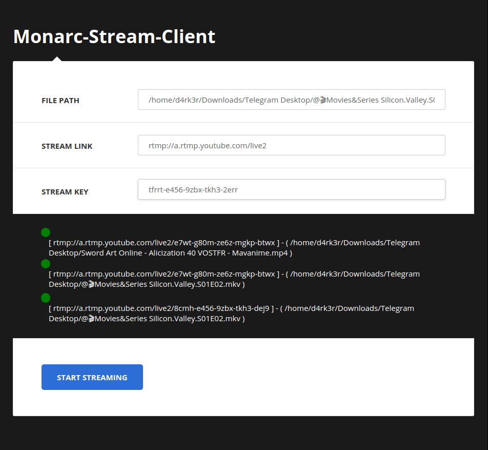

# Monarc-Stream-Client

A Streamer client application using ffmpeg bindings...




## Requirements
- python (3.x is recommended)
- ffmpeg


## How to install

- First you need to install [ffmpeg](https://ffmpeg.org/download.html), depending on your system.

- Create your virtual environment
```
virtualenv -p python3 venv
source venv/bin/activate
```

- You need to install all requirements :
```shell-script
pip3 install -r requirements.txt
```

## How to launch

To start the selenium fetch-API, you just have to run :
```
sh ./start.sh
# or just
python -m app.main
```

## Author

- Sanix-darker
